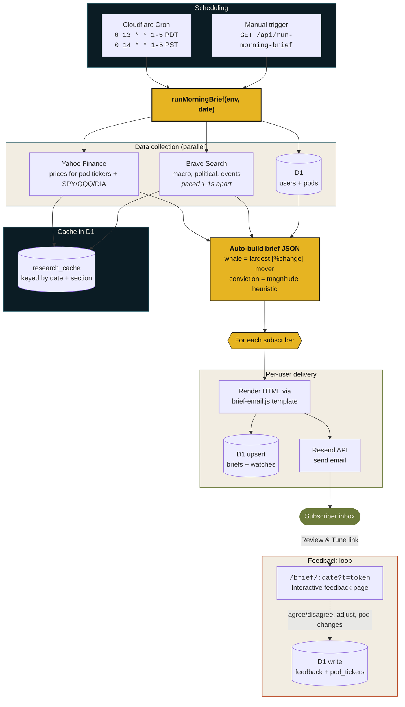
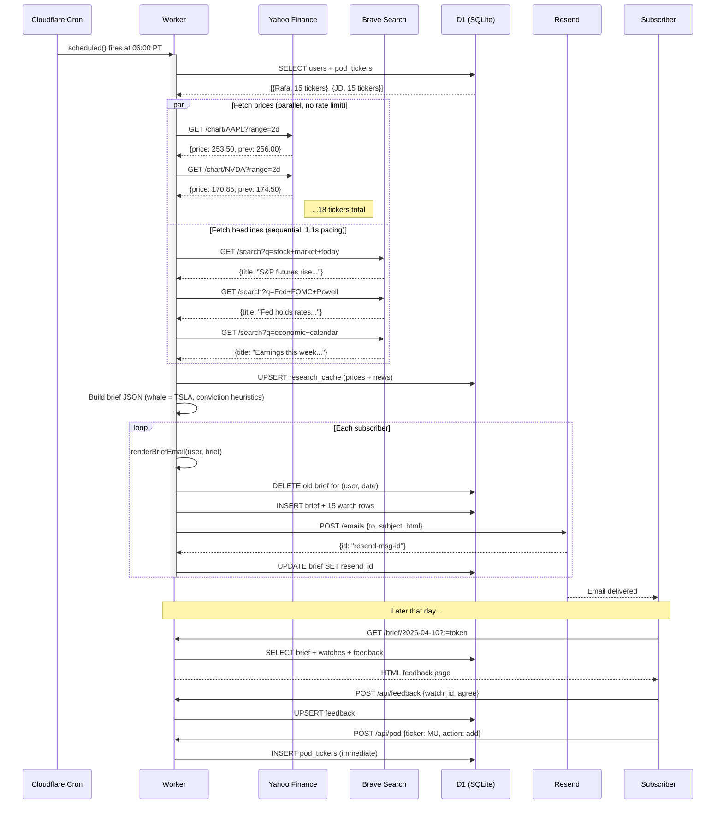
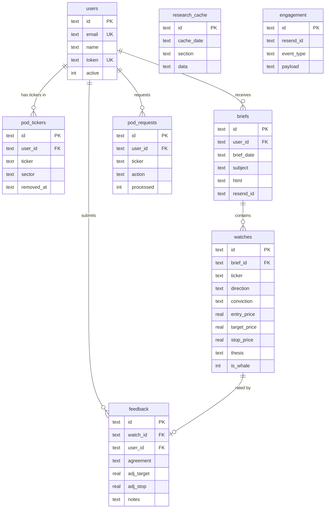
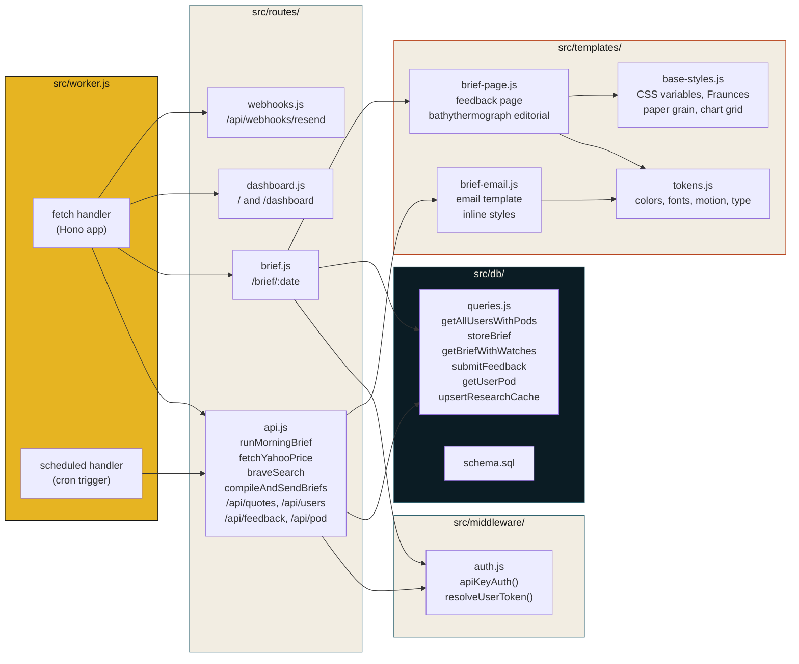

# Architecture

This document explains how Whale Watcher is built, why each component was chosen, and the design decisions that shaped the current version.

---

## System overview

---

## Morning brief sequence

---

## D1 schema

---

## Worker component map

---

## Component responsibilities

### `src/worker.js`
Hono application entry point. Mounts the API routes, the feedback page, the dashboard, and the Resend webhook handler. Exports both `fetch` (HTTP requests) and `scheduled` (cron triggers) from the default export.

### `src/routes/api.js`
All API handlers. Contains:
- `apiKeyAuth()` middleware enforcement on protected routes
- `runMorningBrief(env, date)` -- the core morning routine, callable from both the HTTP path and the cron trigger
- `compileAndSendBriefs(c, body)` -- shared compile-and-send helper used by `compile-brief` (POST) and `compile-and-send` (GET)
- `fetchYahooPrice` and `braveSearch` -- exported upstream clients with explicit error handling

### `src/middleware/auth.js`
API key validation. Accepts the key from either the `X-API-Key` header or the `?key=` query string. Also exposes `resolveUserToken(c)` for token-authenticated user routes.

### `src/db/queries.js`
Parameterized D1 query helpers. Every external SQL access goes through this file. No interpolation, only `prepare(...).bind(...)`.

### `src/templates/tokens.js` + `base-styles.js`
Design system. `tokens.js` exports color, type, motion, and spacing constants. `base-styles.js` exports a `baseStyles()` function that returns the complete `<link>` + `<style>` block for inlining into any HTML route. Loads Fraunces and IBM Plex Mono from bunny.net. Includes paper grain texture, chart-paper grid, conviction gauge, sonar ping, tide-in stagger, and editorial form controls.

### `src/templates/brief-page.js`
The interactive feedback page rendered at `/brief/:date?t=<token>`. Bathythermograph editorial aesthetic with mobile-first plates layout, hero whale section, expandable watch drawers, sticky submit bar, and inline pod management. All state managed via `data-*` attributes and event delegation.

### `src/templates/brief-email.js`
Server-side HTML email template. Renders a single brief object into a complete email body, including the per-user "Review and Tune" link with the user's token.

---

## Data flow

### Morning brief

1. Cloudflare cron trigger fires at 13:00 or 14:00 UTC on weekdays.
2. The Worker `scheduled()` handler computes today's date (UTC) and calls `runMorningBrief(env, today)`.
3. `runMorningBrief` reads all active users and their pods from D1.
4. For each unique ticker across all pods plus `SPY`, `QQQ`, `DIA`, the Worker fetches the latest price from Yahoo Finance in parallel. Crypto symbols are mapped to Yahoo's `-USD` suffix convention. A browser User-Agent is set to avoid edge IP rate limiting.
5. The Worker fetches three news searches from Brave (macro, political, events). Calls are paced 1.1 seconds apart to respect the free-tier rate limit of 1 request per second. If a search returns 429, the result is empty for that section, not a hard failure.
6. Both prices and news are persisted to `research_cache` keyed by `(date, section)` for later inspection or replay.
7. The brief JSON is constructed from the price and news data. The "whale" is the ticker with the largest absolute percent change across any user pod. Conviction ratings are derived from the magnitude of the percent change.
8. For each user, the Worker:
   - Renders the brief to HTML using the user's pod and review token
   - Deletes any prior brief and watches for that user and date (idempotency)
   - Inserts a new brief row and per-watch rows
   - POSTs the email payload to Resend
   - Updates the brief row with the Resend message ID
9. The handler returns a per-user delivery summary.

### Feedback loop

1. The morning brief email contains a "Review and Tune" link to `/brief/:date?t=<token>`.
2. The feedback page is rendered server-side with the user's token validated against the `users` table.
3. The user can mark each watch as agree, disagree, or skip, and optionally adjust target and stop prices. The page uses a bathythermograph editorial design with expandable drawers, conviction gauges, and a sticky submit bar.
4. Submissions go to `POST /api/feedback` with the same token in the query string.
5. Feedback is persisted to the `feedback` table, keyed by `(watch_id, user_id)` so subsequent submissions on the same watch update in place.
6. The data is available to inform future briefs but is not yet used by the auto-build heuristics. See [Future work](#future-work).

### Pod management

1. The user can add or remove a ticker from their pod via `POST /api/pod` or through the feedback page UI.
2. Changes are applied immediately to `pod_tickers`: adds insert a new row (or re-activate a soft-deleted one), removes set `removed_at`. The client updates the DOM instantly without a page reload.
3. An audit trail row is also inserted into `pod_requests` for each action.
4. New tickers appear in the next morning's brief automatically since `runMorningBrief` reads pod_tickers at execution time.

---

## Design decisions

### Why Cloudflare Workers

The original prototype lived on a Raspberry Pi with a Python script and a system cron. That worked but had three problems: the Pi was a single point of failure, the IP was on a residential block (Resend deliverability suffered), and TLS termination was awkward. Cloudflare Workers solves all three: global edge, predictable egress IPs, and free TLS through the zone.

D1 is co-located with the Worker and round-trips in single-digit milliseconds. There is no separate database tier to operate.

### Why Hono

The Worker started as a single file with manual `Request`-based routing. Once there were more than five routes the routing logic was the slowest part to read. Hono is small (a few KB after tree-shaking), works natively on Workers, and has the same routing ergonomics as Express. No middleware framework lock-in: the route handlers are still plain async functions.

### Why no LLM agent

The original architecture used an OpenClaw agent (Gemini 2.5 Flash) running on a Raspberry Pi as the scheduler and brief composer. Two crons were involved: a 05:50 PT "research phase" that fired web searches and POSTed results to a research-cache endpoint, and a 06:10 PT "email phase" that read the cache and POSTed a compiled brief to the email endpoint.

The agent path failed for three compounding reasons:

1. **`web_fetch` is GET-only.** When the prompt instructed the agent to POST data, Gemini hallucinated parameter names (`content`, `extractMode`) that the underlying fetch tool silently dropped. The actual outbound request was always a GET with no body. The Worker's POST handlers therefore never received cached research or compiled briefs. The agent's natural-language summary claimed success because Gemini believed it had POSTed, but no data was ever stored.

2. **Custom headers were not delivered to upstream.** Even on GET requests, the agent's `raw_params` showed an `X-API-Key` header that the upstream Worker never received. We added `?key=` query string fallback to the auth middleware to work around this.

3. **Multi-step prompts were unstable.** Gemini would either blow past its 200k context window when accumulating raw search results (we saw 467k token sessions), return "An unknown error occurred" deterministically on certain prompt shapes, or describe the actions it would take without actually executing the tool calls.

The first fix collapsed the work into a single Worker endpoint and reduced the cron prompt to 300 characters. That worked for one manual trigger and then failed the next morning when the Gemini API itself rate-limited the run because five other crons on the same Pi shared the free-tier quota.

The second fix removed the agent entirely. Cloudflare Workers cron triggers are first-class: they fire on a schedule, invoke the Worker's `scheduled` handler with the cron expression, and have no shared quota with anything else in this account.

The trade-off: LLM-driven personalization is currently off. The brief is auto-generated by simple heuristics. Personalization can be added back later as Worker-side logic that reads each user's `recent_feedback` and adjusts their brief without involving an external LLM.

### Why dual cron schedules

Cloudflare cron triggers run in UTC. There is no built-in DST handling. Rather than do timezone arithmetic in code, the Worker registers two schedules: `0 13 * * 1-5` (06:00 PDT) and `0 14 * * 1-5` (06:00 PST). Both fire year-round. During DST transition weeks, the Worker runs twice but the D1 idempotency (delete-then-insert by `(user_id, brief_date)`) means the second run overwrites the first.

### Why query-string auth

Headers should be the right answer. They are. But the agent path (now removed) could not pass them reliably to upstream, and the same is true for some HTTP clients that share infrastructure with crawlers and proxies. Adding `?key=` as a fallback costs nothing in the Worker, keeps the security model identical, and made the migration to the Worker scheduler easier.

### Why idempotent briefs

The `compileAndSendBriefs` flow deletes and reinserts the brief row for `(user_id, brief_date)` on every call. This means a manual re-trigger of `run-morning-brief` for the same date will overwrite the existing row and send a new email. That is the desired behavior: a brief is the latest known state for that date, not an immutable historical artifact. Historical sends are visible in Resend.

### Why bathythermograph editorial

The frontend design skill mandates a bold aesthetic direction. The "bathythermograph editorial" concept, an oceanographic field journal crossed with a financial terminal, was chosen because:
- It maps naturally to the product's metaphor system (whales, pods, surface, dive)
- Serif typography (Fraunces) reads as editorial dispatch rather than generic SaaS
- The aged-paper palette matches the email template's existing light premium feel
- Chart-paper grids and conviction gauges reinforce the "instrument readout" quality
- It is distinctive enough that it will not be confused with a Tailwind template

The design system lives in `src/templates/tokens.js` (constants) and `src/templates/base-styles.js` (CSS), shared across every HTML page and the email template.

---

## Failure modes and mitigations

| Failure | Detection | Mitigation |
|---------|-----------|------------|
| Yahoo Finance returns null prices | Worker logs `prices_ok < tickers` | Brief still sends with null prices for affected tickers |
| Brave Search returns 429 | Worker logs `error: HTTP 429` | News section becomes empty for that key |
| Resend API rejects an email | `sent: false` in result | Brief is still stored in D1 for retry |
| D1 unavailable | Worker exception | Whole run fails. Cloudflare retries the cron trigger |
| Cron does not fire | Cloudflare dashboard or absent log | Manually trigger via `GET /api/run-morning-brief` |

---

## Future work

Tracked in GitHub issues:

- Re-add personalization by reading `recent_feedback` in the auto-build step and biasing convictions per user
- Add a "skip if already sent today" guard to suppress the DST double-send
- Redesign the public landing page at `/` as a portfolio piece (Commit 4 in the roadmap)
- Retrofit the email template to use the shared design tokens (Commit 5 in the roadmap)
- End-to-end test that hits a staging Worker against a staging D1 database
